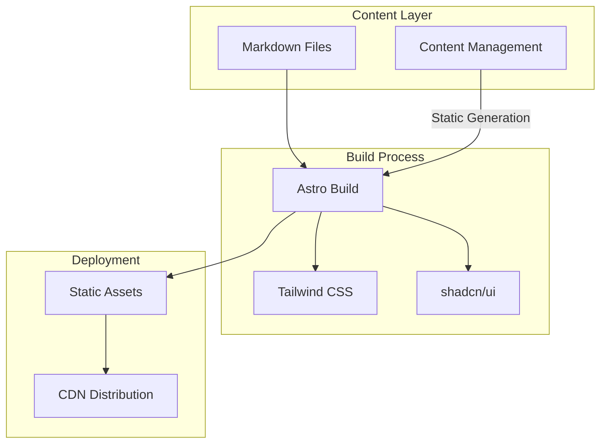
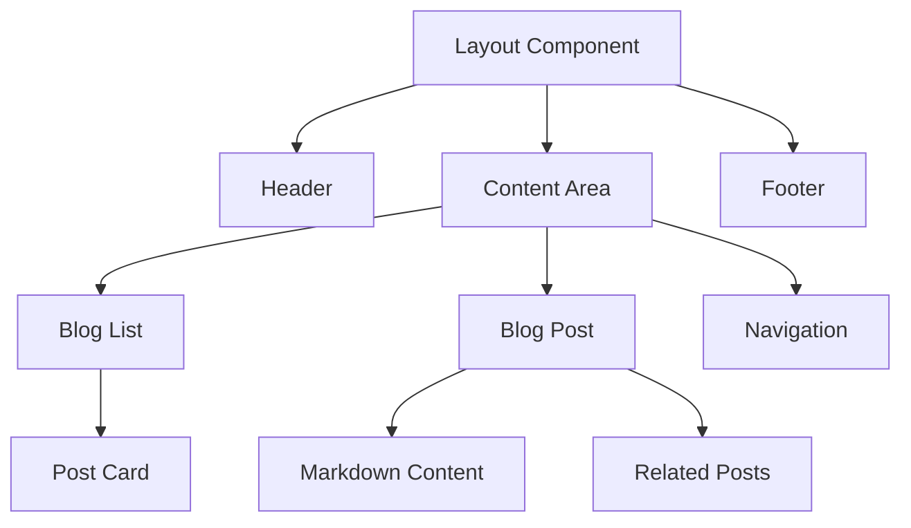

# Astro Blog Architecture

## System Overview
A statically generated blog using Astro, with content management and modern UI components.

## Architecture Diagram


## Core Architecture Decisions

### 1. Content Management
**Decision**: Use local markdown files with Git-based workflow instead of Supabase
**Rationale**:
- Simpler architecture for static content
- Better version control
- Zero hosting costs
- Faster build times
- No database maintenance

### 2. Build System
**Technology**: Astro
**Key Features**:
- Zero-JS by default
- Partial hydration
- Built-in markdown support
- TypeScript integration
- Image optimization

### 3. UI Architecture
**Pattern**: Component-Based Architecture
**Technologies**:
- shadcn/ui for base components
- Tailwind CSS for styling
- Custom components for blog-specific features

### 4. Performance Strategy
1. **Static Asset Optimization**:
   - Image optimization via Astro
   - CSS/JS minification
   - Lazy loading for non-critical resources

2. **Build Optimization**:
   - Incremental builds
   - Asset caching
   - Partial hydration

## Component Architecture


## Data Flow

### Content Pipeline
1. **Markdown Processing**:
   - Frontmatter parsing
   - MDX transformation
   - Code syntax highlighting
   - Image optimization

2. **Build Process**:
   - Static page generation
   - Asset optimization
   - Route generation

## Security Considerations
1. **Content Security**:
   - Sanitize markdown output
   - Implement CSP headers
   - Validate external links

2. **Build Security**:
   - Dependency scanning
   - Input validation
   - Safe dependency versions

## Performance Optimizations
1. **First Load**:
   - Critical CSS inlining
   - Font optimization
   - Image lazy loading

2. **Runtime**:
   - Minimal JavaScript
   - Optimized assets
   - Efficient routing

## Development Workflow
1. **Local Development**:
   ```
   /content/
     posts/
       - post-1.md
       - post-2.md
   /src/
     components/
     layouts/
     styles/
   ```

2. **Build Process**:
   - Content validation
   - TypeScript checking
   - Asset optimization
   - Static generation

## Technical Specifications

### Required Dependencies
```json
{
  "astro": "^4.x",
  "tailwindcss": "^3.x",
  "@shadcn/ui": "^0.x",
  "contentlayer": "^0.x",
  "rehype": "^12.x",
  "remark": "^14.x"
}
```

### Development Tools
- TypeScript for type safety
- ESLint for code quality
- Prettier for formatting
- Husky for git hooks

## Deployment Strategy
1. **Build Pipeline**:
   - Content validation
   - TypeScript compilation
   - Asset optimization
   - Static generation

2. **CDN Distribution**:
   - Edge caching
   - Asset compression
   - Global distribution

## Monitoring and Analytics
1. **Performance Monitoring**:
   - Lighthouse scores
   - Web Vitals tracking
   - Build performance

2. **Usage Analytics**:
   - Page views
   - User engagement
   - Performance metrics

## Future Considerations
1. **Scalability**:
   - Content organization
   - Build performance
   - Asset management

2. **Future Features**:
   - Search functionality
   - RSS feeds
   - Social sharing
   - Comments system

## Risk Assessment
1. **Build Performance**:
   - Monitor build times
   - Implement incremental builds
   - Optimize asset processing

2. **Content Management**:
   - Establish clear content structure
   - Implement content validation
   - Maintain backup strategy

---
Status: Draft
Last Updated: [Current Date] 