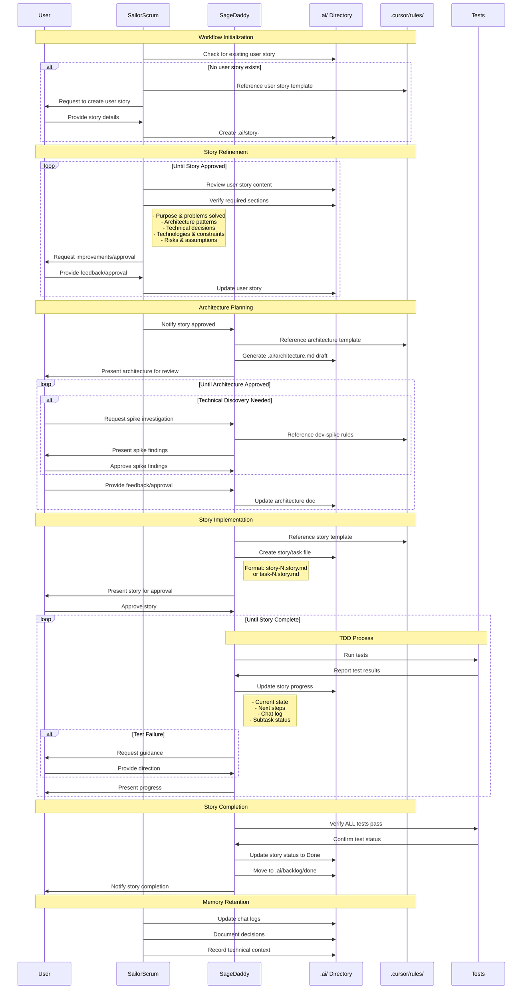

# Lean Workflow Process

This document illustrates the lean workflow process using a sequence diagram.

## Key Components

1. **User**: Provides requirements, feedback, and approvals throughout the process.
2. **SailorScrum**: Manages user story creation, refinement, and memory retention.
3. **SageDaddy**: Handles architecture planning, implementation, and TDD process.
4. **.ai/ Directory**: Core memory system storing all project documentation and stories.
5. **.cursor/rules/**: Contains templates and workflow rules.
6. **Tests**: Ensures code quality through TDD practices.

## Process Phases

1. **Workflow Initialization**: Ensures a proper user story exists with all required sections.
2. **Story Refinement**: Iterates on the user story until it meets quality standards, including:
   - Detailed purpose and problems solved
   - Architecture patterns and technical decisions
   - Technologies, setup, and constraints
   - Unknowns, assumptions, and risks
3. **Architecture Planning**: Creates and refines the technical architecture, with support for technical spikes.
4. **Story Implementation**: 
   - Follows TDD practices
   - Continuously updates story progress
   - Maintains chat logs and technical context
   - Updates subtask completion status
5. **Story Completion**: 
   - Verifies ALL tests pass
   - Archives completed story in backlog
6. **Memory Retention**: Maintains comprehensive documentation of:
   - Technical decisions
   - Chat interactions
   - Implementation context

## Quality Gates

- User story must be approved before architecture planning
- Architecture must be approved before implementation
- Spike findings must be approved before proceeding
- Stories must pass all tests before completion
- Continuous feedback and approval from the user
- No duplication of business/technical context between user story and architecture documents

## Autonomous Actions

Agents may perform these actions without explicit user approval:
1. Create new story files when needed
2. Run unit tests during development
3. Update story acceptance criteria and tasks
4. Update story files with chat logs
5. Create feature, bug, or spike branches

