# Release Workflow Sequence Diagram

## Overview
This sequence diagram illustrates the automated release workflow process, showing interactions between the user, AI agent, git repository, and various files. The workflow prepares for package releases through version bumping, release note generation, changelog updates, and git tagging.

## Sequence Diagram

```mermaid
sequenceDiagram
    participant U as User
    participant A as AI Agent
    participant G as Git Repo
    participant P as package.json
    participant C as changelog.md
    participant R as Release Notes

    Note over U,R: 🚀 Release Workflow Process

    U->>A: Request release creation
    Note right of U: "Create a release"<br/>"Make a release"<br/>"Prepare release notes"

    A->>G: Check current branch
    G-->>A: Return branch name
    
    alt Branch is main/master
        A-->>U: ⚠️ Warning: Cannot release from main
        A-->>U: Suggest creating release branch
        Note right of A: Workflow terminates here
    else Branch is feature/release branch
        A->>A: Validate branch naming conventions
        Note right of A: Check for "release/", "hotfix/", or "fix/" prefix<br/>Only allow appropriate release branches
        
        alt Branch doesn't start with allowed patterns
            A-->>U: Show invalid branch error
            A-->>U: Require "release/", "hotfix/", or "fix/" prefix
            A-->>U: Provide examples of valid branches
            A-->>U: Terminate workflow
            Note right of A: Workflow ends here
        else Branch starts with allowed pattern
            A-->>U: Confirm branch validation passed
        end
        
        A->>P: Validate package.json
        Note right of P: Check file exists, valid JSON,<br/>required fields (name, version),<br/>semantic versioning format
        
        alt Package.json validation fails
            A-->>U: Show validation error
            A-->>U: Provide specific error details
            A-->>U: Terminate workflow
            Note right of A: Workflow ends here
        else Package.json validation passes
            A-->>U: Confirm package.json validation passed
        end
        
        A->>G: Get current version from package.json
        G-->>A: Return current version
        
        A->>G: Get latest git tag
        G-->>A: Return latest tag (or current version if no tags)
        
        A->>G: Analyze commits since last tag
        G-->>A: Return commit list with types
        
        A->>A: Categorize changes
        Note right of A: Features, Bug Fixes,<br/>Breaking Changes, Other
        
        A->>A: Analyze non-conventional commits
        Note right of A: Intelligent categorization based on<br/>message content and file changes<br/>- Feature keywords: add, new, implement<br/>- Fix keywords: fix, bug, issue, problem<br/>- Breaking keywords: remove, delete, deprecate<br/>- Docs keywords: doc, readme, comment
        
        A->>A: Combine conventional and non-conventional
        Note right of A: Merge categorized commits<br/>for comprehensive analysis
        
        A->>A: Suggest version bump
        Note right of A: Major: Breaking changes<br/>Minor: New features<br/>Patch: Bug fixes
        
        alt User specified version bump
            A->>A: Use user-specified version
        else No version specified
            A-->>U: Prompt for version choice
            U-->>A: Choose version bump type
        end
        
        A->>A: Validate version bump against changes
        Note right of A: Check for version mismatches<br/>Block if breaking changes<br/>with non-major version
        
        alt Version mismatch detected
            A-->>U: Show critical error
            A-->>U: List breaking changes
            A-->>U: Offer force continue option
            U-->>A: Choose to force continue or abort
            
            alt User chooses to abort
                A-->>U: Terminate workflow
                Note right of A: Workflow ends here
            else User forces continue
                A-->>U: Warning about potential issues
            end
        else Version validation passed
            A-->>U: Confirm validation passed
        end
        
        A->>R: Generate structured release notes
        Note right of R: Include:<br/>- Release metadata<br/>- Categorized changes<br/>- Commit links<br/>- Migration notes
        
        A->>C: Generate/update changelog.md
        Note right of C: Follow Keep a Changelog format<br/>- Unreleased section<br/>- Version history<br/>- Comparison links
        
        A->>A: Check existing changelog
        Note right of A: Backup existing changelog.md<br/>Validate Keep a Changelog format<br/>Preserve existing content if valid
        
        alt Existing changelog with valid format
            A->>A: Update unreleased section
            Note right of A: Replace [Unreleased] content<br/>Preserve version history<br/>Maintain existing structure
        else No existing changelog or invalid format
            A->>C: Create new changelog
            Note right of C: Generate complete changelog<br/>Include all version history<br/>Add comparison links
        end
        
        A-->>U: Offer package.json version update
        U-->>A: Confirm version update
        
        alt User confirms version update
            A->>P: Update version in package.json
            P-->>A: Confirm version updated
            
            A-->>U: Offer to commit version change
            U-->>A: Confirm commit
            
            alt User confirms commit
                A->>G: Commit version change
                G-->>A: Confirm commit created
                
                A-->>U: Offer to push commit
                U-->>A: Confirm push
                
                alt User confirms push
                    A->>G: Push version commit
                    G-->>A: Confirm push successful
                end
            end
        end
        
        A-->>U: Offer git tag creation
        U-->>A: Confirm tag creation
        
        alt User confirms tag creation
            A->>G: Check if tag already exists
            G-->>A: Return tag existence status
            
            alt Tag already exists
                A-->>U: Show tag conflict error
                A-->>U: Display existing tag details
                A-->>U: Provide resolution options
                U-->>A: Choose resolution option
                
                alt User chooses different version
                    A-->>U: Terminate workflow
                    Note right of A: Workflow ends here
                else User chooses delete tag
                    A->>G: Delete existing tag
                    G-->>A: Confirm tag deleted
                    A->>G: Create new git tag
                    G-->>A: Confirm tag created
                else User chooses skip
                    A-->>U: Skip tag creation
                    Note right of A: Continue without tag
                end
            else Tag doesn't exist
                A->>G: Create git tag
                G-->>A: Confirm tag created
            end
            
            A-->>U: Offer to push tag
            U-->>A: Confirm tag push
            
            alt User confirms tag push
                A->>G: Check for remote tag conflicts
                G-->>A: Return remote tag status
                
                alt Remote tag exists
                    A-->>U: Show remote conflict error
                    A-->>U: Provide remote resolution options
                    U-->>A: Choose remote resolution
                    
                    alt User chooses delete remote tag
                        A->>G: Delete remote tag
                        A->>G: Push local tag
                        G-->>A: Confirm push successful
                    else User chooses keep local only
                        A-->>U: Keep local tag only
                    else User chooses delete local tag
                        A->>G: Delete local tag
                        A-->>U: Tag creation cancelled
                    end
                else No remote conflict
                    A->>G: Push git tag
                    G-->>A: Confirm tag pushed
                end
            end
        end
        
        A-->>U: Provide final instructions
        Note right of A: Next steps:<br/>- Review release notes<br/>- Create PR to main<br/>- Trigger CI/CD
    end
```



## Potential Inconsistencies and Failure Points

### 🔴 Critical Issues

1. **Version Mismatch Detection** ✅ **RESOLVED**
   - **Issue**: User specifies minor version but commits contain breaking changes
   - **Previous Behavior**: Warning shown but proceeded with user choice
   - **New Behavior**: Blocks release with critical error, lists breaking changes, offers force continue option
   - **Implementation**: Added step 5.5 with comprehensive validation logic
   - **Risk**: Previously caused incorrect semantic versioning leading to dependency issues
   - **Status**: ✅ Fixed - workflow now enforces proper semantic versioning

2. **Git Tag Conflicts** ✅ **RESOLVED**
   - **Issue**: Tag already exists for target version
   - **Previous Behavior**: No validation for existing tags
   - **New Behavior**: Checks for existing tags before creation, provides resolution options
   - **Implementation**: Added comprehensive tag validation with local and remote conflict handling
   - **Risk**: Previously caused git tag creation to fail, breaking workflow
   - **Status**: ✅ Fixed - workflow now handles tag conflicts gracefully with multiple resolution options

3. **Branch Protection Bypass** ✅ **RESOLVED**
   - **Issue**: Workflow allows releases from any non-main branch
   - **Previous Behavior**: Accepted any branch name without validation
   - **New Behavior**: Only allows releases from branches starting with "release/", "hotfix/", or "fix/"
   - **Implementation**: Added strict branch validation with regex pattern matching for appropriate release branches
   - **Risk**: Previously allowed releases from inappropriate branches (e.g., `wip/experimental`)
   - **Status**: ✅ Fixed - workflow now enforces proper branch naming conventions for releases

4. **Incomplete Commit Analysis** ✅ **RESOLVED**
   - **Issue**: Only analyzes conventional commit messages, ignores non-conventional commits
   - **Previous Behavior**: Missing important changes in release notes and changelog
   - **New Behavior**: Intelligent categorization of non-conventional commits based on message content and file changes
   - **Implementation**: Added comprehensive analysis with keyword matching and file change detection
   - **Risk**: Previously missed important changes, leading to incomplete release documentation
   - **Status**: ✅ Fixed - workflow now includes all commits with intelligent fallback categorization

5. **Package.json Validation** ✅ **RESOLVED**
   - **Issue**: No validation of package.json structure and content
   - **Previous Behavior**: Assumes valid package.json exists and contains required fields
   - **New Behavior**: Comprehensive validation of file existence, JSON syntax, required fields, and version format
   - **Implementation**: Added validation checks for file existence, JSON parsing, required fields (name, version), and semantic versioning format
   - **Risk**: Previously failed with unclear errors if package.json was malformed or missing fields
   - **Status**: ✅ Fixed - workflow now validates package.json before proceeding with release

6. **Changelog Overwrite** ✅ **RESOLVED**
   - **Issue**: Completely regenerates changelog.md, losing manual edits and custom formatting
   - **Previous Behavior**: Replaces entire file content without preserving existing structure
   - **New Behavior**: Intelligently preserves existing changelog content and merges new changes
   - **Implementation**: Added backup functionality, format validation, and smart merging of unreleased sections
   - **Risk**: Previously lost manual edits, custom formatting, and existing changelog structure
   - **Status**: ✅ Fixed - workflow now preserves existing changelog content while adding new changes

### 🟡 Medium Issues

7. **User Input Validation**
   - **Issue**: No validation of custom version format
   - **Current Behavior**: Accepts any string as version
   - **Risk**: Invalid semantic versions
   - **Recommendation**: Validate version format (x.y.z)

8. **Error Handling**
   - **Issue**: Limited error handling for git operations
   - **Current Behavior**: Assumes git commands succeed
   - **Risk**: Workflow fails silently or with unclear errors
   - **Recommendation**: Add comprehensive error handling

9. **File Path Assumptions**
   - **Issue**: Assumes files are in current directory
   - **Current Behavior**: Uses relative paths
   - **Risk**: Fails in different working directories
   - **Recommendation**: Use absolute paths or validate file locations

## Recommended Improvements

### 1. Enhanced Validation
```bash
# Add version format validation
validate_version_format() {
    local version=$1
    if [[ ! $version =~ ^[0-9]+\.[0-9]+\.[0-9]+$ ]]; then
        echo "❌ Invalid version format: $version"
        echo "Expected format: x.y.z (e.g., 1.2.3)"
        return 1
    fi
}

# Add tag existence check
check_tag_exists() {
    local version=$1
    if git tag -l "v$version" | grep -q "v$version"; then
        echo "❌ Tag v$version already exists"
        return 1
    fi
}
```

### 2. Improved Error Handling
```bash
# Add error handling wrapper
execute_with_error_handling() {
    local command="$1"
    local error_message="$2"
    
    if ! eval "$command"; then
        echo "❌ $error_message"
        echo "Command failed: $command"
        return 1
    fi
}
```

### 3. Branch Validation
```bash
# Add branch naming validation
validate_branch_name() {
    local branch=$1
    if [[ ! $branch =~ ^(feature|release|hotfix|bugfix)/.+ ]]; then
        echo "⚠️ Warning: Branch '$branch' doesn't follow naming conventions"
        echo "Recommended: feature/name, release/version, hotfix/description"
        read -p "Continue anyway? (y/N): " continue_anyway
        [[ ! "$continue_anyway" =~ ^[Yy]$ ]] && return 1
    fi
}
```

### 4. Changelog Preservation
```bash
# Preserve existing changelog
backup_changelog() {
    if [ -f "changelog.md" ]; then
        cp changelog.md changelog.md.backup
        echo "📋 Backed up existing changelog.md"
    fi
}

restore_changelog_on_error() {
    if [ -f "changelog.md.backup" ]; then
        mv changelog.md.backup changelog.md
        echo "🔄 Restored original changelog.md"
    fi
}
```

## Workflow Success Metrics

- **Completion Rate**: Percentage of workflows that complete successfully
- **Error Recovery**: Ability to recover from failures gracefully
- **User Satisfaction**: Reduced manual intervention required
- **Version Accuracy**: Correct semantic versioning based on changes
- **Documentation Quality**: Comprehensive and accurate release notes

---

**Note**: This sequence diagram represents the current implementation. The identified issues should be addressed to improve workflow reliability and user experience. 